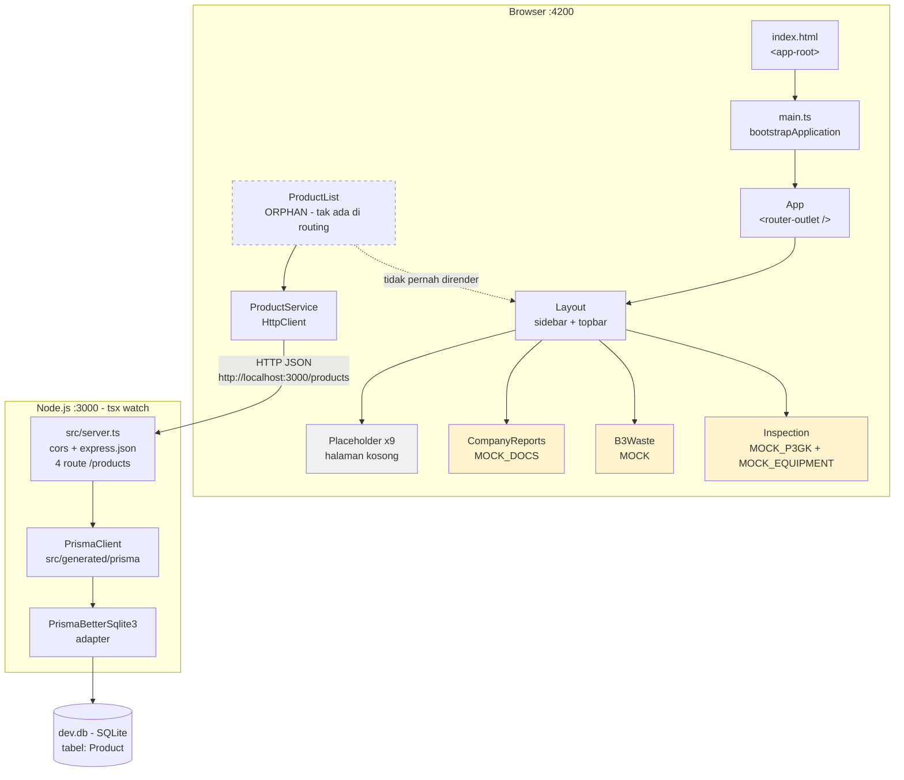

# 02 - ARSITEKTUR AS-IS: Otsuka Work Permit

| Field | Value |
|---|---|
| Task | AZK-001 - Studi & Dokumentasi Arsitektur Existing |
| Role | Architect (Azkha Company) |
| Tanggal | 2026-08-14 |
| Project root | `d:\000 dokumen\004 carrier\MAGANG HUB\otsuka` |
| Sifat dokumen | **Deskriptif (as-is)** - menggambarkan kondisi yang ADA, bukan desain target |
| Delta kode | **0** - tidak ada file di `frontend/` atau `backend/` yang dibaca-tulis, hanya dibaca |

> **Catatan penyesuaian scope (penting untuk PM).**
> Spec `01-spec.md` Bagian 6 meminta 10 bagian, di mana bagian 9 (`ADR-001`: rekomendasi arsitektur fitur EHS berikutnya) dan bagian 10 (`Rekomendasi bertingkat`) bersifat **forward-looking**. User memberi arahan eksplisit untuk **melewatkan bagian rekomendasi** ("Tidak, laporan as-is saja" / "yang kamu dapat itu yang dilaporkan ke saya"). Karena itu bagian 9 dan 10 di dokumen ini **diganti** menjadi bagian faktual: **9. Ringkasan Kondisi Sekarang** dan **10. Koreksi & Catatan Verifikasi**. Jumlah bagian tetap 10 (memenuhi AC1), tetapi **AC6 (format ADR Konteks/Opsi/Rekomendasi/Konsekuensi) sengaja tidak dipenuhi atas arahan user** - ini perlu dicatat PM saat gerbang DoD, bukan dianggap kelalaian.
>
> Seluruh pernyataan di dokumen ini diverifikasi langsung dengan membaca file sumber. Tidak ada klaim yang berasal dari asumsi atau ringkasan pihak lain. Di mana saya **tidak** mengeksekusi sesuatu (misalnya menjalankan test), hal itu dinyatakan terbuka.

---

## 1. Executive Summary

Project Otsuka Work Permit terdiri dari **dua sub-project yang berdiri sendiri**: `frontend/` (aplikasi Angular yang berjalan di browser) dan `backend/` (server Express yang menyimpan data ke database SQLite lewat Prisma). Keduanya tidak berbagi kode, tidak berada dalam satu monorepo, dan dijalankan sebagai dua proses terpisah di komputer lokal.

Kondisi paling penting yang perlu dipahami: **hampir seluruh aplikasi yang terlihat di layar saat ini belum tersambung ke database.** Menu di sidebar berisi 12 tujuan navigasi. Sembilan di antaranya (Dashboard, Project, Task Approval, Project Active, Master Vendor/PIC/Job Type, Guideline, Audit Log) hanya menampilkan halaman kosong bertuliskan "belum memiliki konten". Tiga sisanya (Laporan HQ Jepang, Limbah B3, Inspeksi & Sertifikasi) sudah punya tampilan yang cukup matang - lengkap dengan tabel, filter, form tambah data, dan kartu statistik - tetapi **seluruh datanya adalah data contoh (mock) yang ditulis langsung di dalam file komponen**. Kalau halaman di-refresh, semua data yang diinput hilang, karena tidak pernah ada yang dikirim ke server.

Satu-satunya jalur yang benar-benar tersambung ujung-ke-ujung (browser → server → database) adalah **CRUD Produk**. Namun jalur ini **tidak bisa diakses dari UI**: komponennya tidak terdaftar di routing mana pun, jadi ia adalah kode yang hidup tapi tidak terpakai (*orphan*). Ini konsisten dengan keterangan di spec bahwa Product CRUD adalah latihan pola koneksi, bukan fitur bisnis Otsuka.

Backend-nya sangat minimal: **satu file** `src/server.ts` berisi 47 baris yang memuat 4 endpoint, tanpa lapisan pemisah (controller/service/repository), tanpa autentikasi, tanpa validasi input, dan tanpa penanganan error terpusat. Database hanya punya **satu tabel** (`Product`). Tidak ada domain model EHS apa pun di database.

Secara teknologi, project ini justru memakai pilihan yang sangat baru dan modern: Angular 22 dengan *standalone components*, *signals*, dan mode *zoneless*; Express 5; Prisma 7 dengan *driver adapter*. Tidak ada UI library eksternal - seluruh tampilan dibangun dengan CSS biasa dan ikon SVG yang ditulis tangan.

Ringkasnya: **fondasi teknologi sudah modern dan rapi, lapisan tampilan untuk tiga fitur EHS sudah jadi prototipe yang bagus, tetapi lapisan data untuk fitur bisnis belum ada sama sekali.**

---

## 2. Peta Sistem

### 2.1 Gambaran umum (dua proses terpisah)

```
┌──────────────────────────────────────────────────────────────────────────┐
│  BROWSER  (http://localhost:4200)                                        │
│                                                                          │
│   index.html  →  <app-root>                                              │
│        │                                                                 │
│        ▼                                                                 │
│   main.ts  ──bootstrapApplication(App, appConfig)                        │
│        │                                                                 │
│        ▼                                                                 │
│   App (app.ts)  →  template hanya <router-outlet />                      │
│        │                                                                 │
│        ▼                                                                 │
│   Layout (layout/layout.ts)   ← shell: sidebar + topbar                  │
│        │  membaca MENU dari shared/menu.ts                               │
│        │                                                                 │
│        ├─► Placeholder ......... 9 route (halaman kosong)                │
│        ├─► CompanyReports ...... data MOCK di dalam file  ⛔ no network   │
│        ├─► B3Waste ............. data MOCK di dalam file  ⛔ no network   │
│        └─► Inspection .......... data MOCK di dalam file  ⛔ no network   │
│                                                                          │
│   ProductList (components/product-list) ── TIDAK ADA DI ROUTING ──┐      │
│        │  (orphan: tidak terjangkau dari UI)                      │      │
│        ▼                                                          │      │
│   ProductService (services/product.ts)                            │      │
│        │  HttpClient, API_URL hardcoded                           │      │
└────────┼──────────────────────────────────────────────────────────┼──────┘
         │  HTTP/JSON (cross-origin, diizinkan oleh cors())         │
         ▼                                                          │
┌──────────────────────────────────────────────────────────────────────────┐
│  NODE.JS  v24.18.0   (http://localhost:3000)   proses `tsx watch`        │
│                                                                          │
│   src/server.ts  (SATU file, 47 baris)                                   │
│      app.use(cors())                                                     │
│      app.use(express.json())                                             │
│         │                                                                │
│         ├─ GET    /products                                              │
│         ├─ POST   /products                                              │
│         ├─ PUT    /products/:id                                          │
│         └─ DELETE /products/:id                                          │
│                   │                                                      │
│                   ▼  prisma.product.* dipanggil LANGSUNG di handler      │
│   PrismaClient (dari ./generated/prisma/client)                          │
│                   │                                                      │
│                   ▼                                                      │
│   PrismaBetterSqlite3 adapter  ← url dari process.env.DATABASE_URL       │
│                   │                                                      │
│                   ▼  better-sqlite3 (native, sinkron)                    │
└───────────────────┼──────────────────────────────────────────────────────┘
                    ▼
┌──────────────────────────────────────────────────────────────────────────┐
│  FILE  backend/dev.db  (SQLite, 20 KB)                                   │
│    tabel: Product  |  _prisma_migrations  |  sqlite_sequence             │
└──────────────────────────────────────────────────────────────────────────┘
```

### 2.2 Versi Mermaid



Legenda warna: kuning = frontend-only dengan data mock; abu-abu = placeholder kosong; garis putus-putus = kode orphan.

---

## 3. Stack per Layer + Versi

Semua versi di bawah diverifikasi dua kali: **(a) apa yang tertulis di `package.json`** (rentang yang diminta) dan **(b) apa yang benar-benar terpasang di `node_modules`** (versi aktual). Keduanya dicantumkan karena bisa berbeda.

### 3.1 Frontend - `frontend/package.json`

| Paket | Diminta di package.json | Terpasang | Catatan |
|---|---|---|---|
| `@angular/core` | `^22.1.0` | **22.1.1** | Inti framework |
| `@angular/common` | `^22.1.0` | 22.1.x | Menyediakan `HttpClient`, `DatePipe`, `DecimalPipe` |
| `@angular/compiler` | `^22.1.0` | 22.1.x | |
| `@angular/forms` | `^22.1.0` | 22.1.x | Dipakai lewat `FormsModule` (`ngModel`) |
| `@angular/platform-browser` | `^22.1.0` | 22.1.x | Menyediakan `bootstrapApplication`, `DomSanitizer` |
| `@angular/router` | `^22.1.0` | 22.1.x | |
| `rxjs` | `~7.8.0` | **7.8.2** | Library aliran data asinkron; dipakai untuk `.subscribe()` pada HTTP |
| `tslib` | `^2.3.0` | - | Helper runtime TypeScript |
| `@angular/build` | `^22.1.3` | **22.1.3** | Builder resmi (esbuild + Vite), menggantikan webpack |
| `@angular/cli` | `^22.1.3` | **22.1.3** | |
| `@angular/compiler-cli` | `^22.1.0` | 22.1.x | |
| `typescript` | `~6.0.2` | **6.0.3** | |
| `vitest` | `^4.0.8` | **4.1.10** | Test runner (bukan Karma/Jasmine) |
| `jsdom` | `^28.0.0` | - | Simulasi DOM untuk test |
| `prettier` | `^3.8.1` | - | Formatter, dikonfigurasi di `.prettierrc` |
| Package manager | `npm@11.16.0` | - | Ditetapkan lewat field `packageManager` |

**Yang menonjol di frontend:**

1. **Standalone components, tanpa NgModule.** Diverifikasi: tidak ada satu pun `@NgModule` di `frontend/src/`. Setiap komponen mendeklarasikan dependensinya sendiri lewat properti `imports`, contoh di `layout/layout.ts:8` - `imports: [RouterLink, RouterLinkActive, RouterOutlet, IconComponent]`. Konfigurasi aplikasi dipusatkan di `app.config.ts` sebagai daftar `providers`.

2. **Zoneless (tanpa zone.js).** Ini diverifikasi dari tiga arah sekaligus:
   - `zone.js` **tidak ada** di `dependencies` maupun `devDependencies` `frontend/package.json`.
   - Folder `frontend/node_modules/zone.js` **tidak ada** (dicek langsung).
   - Di `frontend/package-lock.json`, `zone.js` hanya muncul sebagai *optional peer dependency* dari `@angular/core` (`"zone.js": "~0.15.0 || ~0.16.0"` dengan blok `optional`), bukan sebagai paket yang di-install.
   - `angular.json` **tidak punya** entri `polyfills` sama sekali.

   **Catatan koreksi halus:** `app.config.ts` **tidak memanggil** `provideZonelessChangeDetection()` secara eksplisit. Jadi aplikasi ini zoneless karena **itulah perilaku default Angular 22** ketika zone.js tidak dipasang - bukan karena ada baris kode yang menyalakannya. (Fungsi `provideZonelessChangeDetection` memang tersedia di API Angular 22, saya cek ada di typings `@angular/core`, tapi tidak dipakai di project ini.) Praktis hasilnya sama; yang berbeda adalah *sumber* keputusan itu - default framework, bukan keputusan eksplisit yang tertulis di kode.

3. **Signals sebagai satu-satunya mekanisme state.** *Signal* adalah wadah nilai reaktif Angular: kalau isinya berubah, tampilan yang membacanya otomatis ikut diperbarui. Dipakai konsisten di seluruh komponen, contoh `layout/layout.ts:17-20` (`collapsed`, `darkMode`, `openGroups`, `pageTitle`) dan `pages/company-reports/company-reports.ts:37-42`. Turunannya memakai `computed()` (nilai yang dihitung ulang otomatis), contoh `company-reports.ts:46-68` (`periods`, `filtered`, `counts`). **Tidak ada NgRx, tidak ada Redux, tidak ada state management library apa pun** - semuanya signal lokal di dalam komponen masing-masing.

4. **Dekorator `@Service()` - API baru Angular 22.** `services/product.ts:7` memakai `@Service()`, bukan `@Injectable({ providedIn: 'root' })` yang selama ini lazim. Saya verifikasi ini bukan salah ketik: `Service` benar-benar diekspor dari `@angular/core` v22 (`node_modules/@angular/core/types/core.d.ts:1322` → `declare const Service: ServiceDecorator;`). Menurut dokumentasi typings-nya, `@Service()` menandai kelas sebagai service yang **otomatis tersedia di sistem dependency injection** (default `autoProvided: true`), jadi efeknya setara `providedIn: 'root'`. Ini pilihan API yang sangat baru dan patut dicatat sebagai konvensi yang sudah dipakai di codebase ini.

5. **Control flow blocks (`@if`, `@for`, `@empty`) di template, bukan direktif lama.** Diverifikasi di `layout/layout.html:9-38`, `components/product-list/product-list.html:26-41`. Tidak ada `*ngIf` / `*ngFor` di seluruh project.

6. **Tidak ada UI library sama sekali.** Tidak ada Tailwind, Angular Material, Bootstrap, atau PrimeNG di `package.json`. Styling murni CSS dengan CSS custom properties (variabel CSS) yang didefinisikan di `src/styles.css` (73 baris) - termasuk satu set variabel terpisah untuk mode gelap di selector `:root.dark` (`styles.css:32-49`). Ikon pun tidak memakai library: `shared/icon/icon.ts` berisi 18 ikon SVG yang ditulis manual sebagai objek `Record<string, string>`, dengan komentar eksplisit di `icon.ts:4` - *"ponytail: hand-picked minimal stroke icon set instead of an icon-library dependency"*.

7. **Test runner Vitest, bukan Karma.** `angular.json` memakai builder `@angular/build:unit-test`, dan `tsconfig.spec.json` memuat `types: ["vitest/globals"]`.

### 3.2 Backend - `backend/package.json`

| Paket | Diminta di package.json | Terpasang | Catatan |
|---|---|---|---|
| `express` | `^5.2.1` | **5.2.1** | Framework HTTP |
| `cors` | `^2.8.6` | **2.8.6** | Middleware Cross-Origin Resource Sharing |
| `@prisma/client` | `^7.9.1` | **7.9.1** | ORM runtime |
| `@prisma/adapter-better-sqlite3` | `^7.9.1` | **7.9.1** | Driver adapter Prisma 7 untuk SQLite |
| `better-sqlite3` | (transitif) | **12.11.1** | Driver SQLite native, sinkron |
| `prisma` (CLI) | `^7.9.1` | **7.9.1** | devDependency |
| `tsx` | `^4.23.12` | **4.23.12** | Menjalankan TypeScript langsung tanpa build |
| `typescript` | `^7.0.2` | **7.0.2** | devDependency |
| `dotenv` | `^17.4.2` | - | **devDependency**, tapi di-import saat runtime (lihat §8) |
| `@types/express` | `^5.0.6` | - | |
| `@types/cors` | `^2.8.19` | - | |
| `@types/node` | `^26.2.0` | - | |
| Node.js runtime | - | **v24.18.0** | Diverifikasi lewat `node --version` |

**Yang menonjol di backend:**

1. **`tsx watch` sebagai runtime, bukan build.** `package.json:7` → `"dev": "tsx watch src/server.ts"`. `tsx` mentranspilasi TypeScript on-the-fly (memakai esbuild) dan me-restart proses saat file berubah. Konsekuensinya: **TypeScript tidak pernah melakukan type-check di alur kerja backend**. Tidak ada script `build`, tidak ada script `typecheck`. File `tsconfig.json` ada (dengan `strict: true`, `outDir: "dist"`), tetapi **tidak ada satu pun npm script yang memanggil `tsc`** - jadi konfigurasi strict itu hanya berlaku untuk feedback di editor, tidak pernah menjadi gerbang yang bisa menggagalkan apa pun.

2. **Prisma 7 dengan pola driver adapter.** Ini pola baru Prisma 7. Perhatikan `prisma/schema.prisma:11-13`:
   ```prisma
   datasource db {
     provider = "sqlite"
   }
   ```
   **Tidak ada field `url` di blok `datasource`** - berbeda dari pola Prisma 5/6 yang lazim. Koneksi database di-supply dari dua tempat berbeda:
   - **Saat runtime:** `src/server.ts:8` → `new PrismaBetterSqlite3({ url: process.env.DATABASE_URL! })`, lalu adapter itu diserahkan ke client di baris 9 → `new PrismaClient({ adapter })`.
   - **Saat menjalankan CLI (`prisma migrate`, dll.):** `prisma.config.ts:11-13` → `datasource: { url: process.env["DATABASE_URL"] }`.

3. **Prisma client di-generate ke dalam source tree.** `schema.prisma:6-9` → `generator client { provider = "prisma-client", output = "../src/generated/prisma" }`. Jadi `server.ts:5` meng-import dari path relatif lokal (`./generated/prisma/client`), bukan dari `@prisma/client`. Folder itu **di-ignore** oleh `backend/.gitignore:5`, artinya siapa pun yang meng-clone project harus menjalankan `prisma generate` dulu sebelum server bisa jalan.

4. **`"type": "commonjs"`** di `backend/package.json:13`, sejalan dengan `tsconfig.json` yang memakai `"module": "commonjs"`.

5. **Perangkat bantu agent.** Backend memuat `backend/.agents/skills/` (8 skill Prisma resmi: `prisma-cli`, `prisma-client-api`, `prisma-compute`, `prisma-database-setup`, `prisma-driver-adapter-implementation`, `prisma-mongodb-upgrade`, `prisma-postgres-setup`, `prisma-postgres`, `prisma-upgrade-v7`), beserta `backend/skills-lock.json` dan folder cermin `backend/.claude/skills/` dan `backend/.windsurf/skills/`. Ini dokumentasi untuk AI coding assistant, bukan kode aplikasi - tidak memengaruhi runtime.

### 3.3 Database

| Aspek | Nilai | Sumber verifikasi |
|---|---|---|
| Engine | SQLite (file tunggal) | `schema.prisma:12` |
| File | `backend/dev.db`, 20.480 byte | `ls -la backend/dev.db` |
| Connection string | `DATABASE_URL="file:./dev.db"` | `backend/.env:8` |
| Driver | `better-sqlite3` 12.11.1 (native, sinkron) | `node_modules/better-sqlite3/package.json` |
| Jumlah tabel domain | **1** (`Product`) | Scan isi `dev.db`: hanya ditemukan `Product`, `_prisma_migrations`, `sqlite_sequence` |
| Migrasi | 1 migrasi: `20260812044529_init` | `backend/prisma/migrations/` |
| Lock provider | `sqlite` | `prisma/migrations/migration_lock.toml:3` |

Isi migrasi (`prisma/migrations/20260812044529_init/migration.sql`) persis mencerminkan model Prisma - tidak ada drift:

```sql
CREATE TABLE "Product" (
    "id" INTEGER NOT NULL PRIMARY KEY AUTOINCREMENT,
    "name" TEXT NOT NULL,
    "category" TEXT NOT NULL,
    "stock" INTEGER NOT NULL DEFAULT 0,
    "price" REAL NOT NULL DEFAULT 0,
    "createdAt" DATETIME NOT NULL DEFAULT CURRENT_TIMESTAMP
);
```

---

## 4. Struktur Folder & Tanggung Jawab

### 4.1 Root project

```
otsuka/
├── frontend/     Aplikasi Angular   (npm project sendiri)
├── backend/      Server Express     (npm project sendiri)
└── workspace/    Dokumen proses Azkha Company (folder task ini)
```

Tidak ada `package.json` di root, tidak ada npm workspaces, tidak ada Nx/Turborepo. Kedua sub-project sepenuhnya independen: masing-masing punya `package.json`, `package-lock.json`, `node_modules`, dan `tsconfig.json` sendiri. Tidak ada kode atau tipe yang dibagi antar keduanya - `frontend/src/app/models/product.ts` dan `backend/prisma/schema.prisma` mendefinisikan bentuk `Product` secara terpisah dan manual.

### 4.2 Frontend

```
frontend/
├── angular.json            Konfigurasi builder. Builder: @angular/build:application
│                           Tidak ada entri "polyfills" (konsisten dengan zoneless)
│                           Tidak ada konfigurasi "proxy" untuk dev server
├── package.json            Dependensi + script (start / build / watch / test)
├── tsconfig.json           Base config. Ketat: noImplicitOverride,
│                           noPropertyAccessFromIndexSignature, noImplicitReturns,
│                           noFallthroughCasesInSwitch
├── tsconfig.app.json       Untuk kode aplikasi (exclude *.spec.ts)
├── tsconfig.spec.json      Untuk test (types: ["vitest/globals"])
├── .prettierrc             printWidth 100, singleQuote, parser "angular" untuk .html
├── .editorconfig / .vscode/  Konfigurasi editor
├── public/favicon.ico      Aset statis
├── dist/frontend/          ARTEFAK BUILD yang ada di disk (bukan source)
└── src/
    ├── index.html          Shell HTML. <title> masih "Frontend" (default scaffold)
    ├── main.ts             Entry point: bootstrapApplication(App, appConfig)
    ├── styles.css          Design token global (variabel CSS) + tema gelap :root.dark
    └── app/
        ├── app.ts          Root component. Isinya hanya properti title (tidak dipakai)
        ├── app.html        Isinya hanya <router-outlet />
        ├── app.css         KOSONG (0 byte)
        ├── app.config.ts   Providers: provideBrowserGlobalErrorListeners,
        │                   provideRouter(routes), provideHttpClient()
        ├── app.routes.ts   SATU-SATUNYA definisi routing. 13 route.
        ├── app.spec.ts     Test scaffold bawaan (lihat §8, sudah usang)
        │
        ├── layout/         SHELL APLIKASI
        │   ├── layout.ts   Sidebar collapse, dark mode, fullscreen, judul halaman
        │   ├── layout.html Markup sidebar + topbar + <router-outlet />
        │   └── layout.css  235 baris
        │
        ├── shared/         Yang dipakai lintas fitur
        │   ├── menu.ts     SUMBER TUNGGAL struktur menu (interface MenuItem/MenuChild
        │   │               + const MENU berisi 10 entri)
        │   ├── icon/icon.ts  Komponen <app-icon>, 18 ikon SVG inline
        │   └── feature-page.css  302 baris, dishare oleh 3 halaman EHS
        │
        ├── pages/          SATU FOLDER PER FITUR
        │   ├── placeholder/placeholder.ts   Komponen generik "belum ada konten".
        │   │                                Template & style INLINE (tanpa file .html/.css).
        │   │                                Judul diambil dari route data['title'].
        │   ├── company-reports/  Laporan HQ Jepang - MOCK
        │   ├── b3-waste/         Limbah B3 - MOCK
        │   └── inspection/       Inspeksi & Sertifikasi - MOCK
        │
        ├── components/     (hanya berisi sisa latihan Product)
        │   └── product-list/  ORPHAN - tidak dirujuk file mana pun
        │
        ├── services/
        │   └── product.ts  ProductService. @Service(). API_URL hardcoded.
        │
        └── models/
            └── product.ts  interface Product (5 field, TANPA createdAt)
```

**Konvensi penamaan yang terbaca (bukan aturan tertulis, tapi konsisten di seluruh codebase):**
- Nama file: `kebab-case`, **tanpa sufiks tipe**. Bukan `layout.component.ts`, tapi `layout.ts`. Bukan `product.service.ts`, tapi `product.ts` (di dalam folder `services/`). Ini gaya scaffold Angular modern - tipe artefak dinyatakan lewat **folder**, bukan lewat nama file.
- Nama kelas: `PascalCase` tanpa sufiks `Component` (`Layout`, `Placeholder`, `CompanyReports`, `B3Waste`, `Inspection`, `ProductList`). Pengecualian: `IconComponent` (di `shared/icon/icon.ts`) dan `ProductService` **masih memakai sufiks** - jadi konvensinya belum 100% seragam.
- Selector: prefix `app-` (`app-layout`, `app-icon`, `app-placeholder`, `app-company-reports`, `app-b3-waste`, `app-inspection`, `app-product-list`). Prefix ini ditetapkan di `angular.json` (`"prefix": "app"`).
- Komponen besar → file terpisah (`.ts` + `.html` + `.css`). Komponen kecil → inline (`placeholder.ts`, `icon.ts`).
- Data mock ditaruh sebagai `const` di atas kelas komponen, dengan nama HURUF BESAR (`MOCK_DOCS`, `MOCK`, `MOCK_P3GK`, `MOCK_EQUIPMENT`, `DEPARTMENTS`, `WASTE_TYPES`, `ICONS`, `EMPTY_FORM`, `API_URL`, `MENU`).
- Injeksi dependensi selalu memakai fungsi `inject()`, tidak pernah lewat parameter constructor. Diverifikasi di `layout.ts:13-14`, `placeholder.ts:44`, `icon.ts:43`, `product-list.ts:16`, `product.ts:9`.

### 4.3 Backend

```
backend/
├── package.json         Script hanya "dev" (tsx watch) dan "test" (echo + exit 1)
├── tsconfig.json        target ES2022, module commonjs, strict true, outDir "dist"
│                        (tidak pernah dieksekusi - tidak ada script yang memanggil tsc)
├── prisma.config.ts     Config CLI Prisma 7: lokasi schema, lokasi migrations,
│                        dan datasource.url dari env
├── .env                 DATABASE_URL="file:./dev.db"  (di-gitignore)
├── dev.db               File database SQLite
├── prisma/
│   ├── schema.prisma    generator + datasource + model Product
│   └── migrations/
│       ├── 20260812044529_init/migration.sql
│       └── migration_lock.toml
├── src/
│   ├── server.ts        SELURUH APLIKASI. 47 baris.
│   └── generated/prisma/  Prisma Client hasil generate (gitignored, 8 file)
│       ├── client.ts, models.ts, enums.ts, browser.ts, commonInputTypes.ts
│       ├── models/Product.ts
│       └── internal/{class.ts, prismaNamespace.ts, prismaNamespaceBrowser.ts}
├── .agents/skills/      Dokumentasi skill Prisma untuk AI assistant (9 skill)
├── .claude/skills/      Cermin dari .agents/skills
├── .windsurf/skills/    Cermin dari .agents/skills
└── skills-lock.json     Lockfile untuk skill di atas
```

**Struktur lapisan backend: tidak ada.** `src/` hanya berisi `server.ts` dan folder generated. Tidak ada `routes/`, `controllers/`, `services/`, `repositories/`, `middlewares/`, `validators/`, `utils/`, atau `config/`. Semua tanggung jawab - bootstrap aplikasi, konfigurasi middleware, definisi route, akses database, dan pembentukan response - berada di satu file yang sama.

---

## 5. Alur Data End-to-End

Bagian ini menelusuri **satu-satunya** jalur di project ini yang benar-benar menyentuh database, sampai ke nama fungsi dan nomor baris. Perlu diingat sejak awal: jalur ini **tidak bisa dipicu dari UI** karena `ProductList` tidak terdaftar di routing (lihat §6). Yang diuraikan di sini adalah **apa yang akan terjadi bila komponen itu dirender** - alur kodenya lengkap dan valid, hanya pintu masuknya yang hilang.

### 5.1 Alur BACA - menampilkan daftar produk (`GET /products`)

| # | Lokasi | Yang terjadi |
|---|---|---|
| 1 | `product-list.ts:22-24` | Angular memanggil `ngOnInit()` setelah komponen dibuat. Isinya `this.reload()`. |
| 2 | `product-list.ts:27` | `reload()` memanggil `this.productService.list()`. |
| 3 | `product.ts:11-13` | `list()` menjalankan `this.http.get<Product[]>(API_URL)` dan mengembalikan sebuah **Observable**. Belum ada request yang terkirim di titik ini - Observable Angular bersifat *cold*, request baru berangkat saat ada yang `subscribe`. |
| 4 | `product.ts:5` | `API_URL` bernilai literal `'http://localhost:3000/products'`. Nilai ini **tertulis langsung di source code**, bukan dari file environment. |
| 5 | `product-list.ts:27` | `.subscribe(...)` dipanggil → **request HTTP benar-benar berangkat**. |
| 6 | Jaringan | `GET http://localhost:3000/products`. Karena halaman berjalan di `localhost:4200` dan server di `localhost:3000`, ini adalah **cross-origin request** - browser akan memblokirnya kecuali server mengirim header CORS yang mengizinkan. |
| 7 | `server.ts:11` | `app.use(cors())` dipanggil **tanpa argumen** → header `Access-Control-Allow-Origin: *`. Semua origin diizinkan. Inilah yang membuat langkah 6 lolos. |
| 8 | `server.ts:12` | `app.use(express.json())` mem-parse body JSON. Untuk GET tidak berpengaruh. |
| 9 | `server.ts:15` | Handler `app.get("/products", ...)` cocok dan dieksekusi. Parameter request diberi nama `_req` (underscore = sengaja tidak dipakai). |
| 10 | `server.ts:16` | `await prisma.product.findMany({ orderBy: { id: "asc" } })`. Prisma Client dipanggil **langsung di dalam route handler** - tidak ada lapisan service atau repository di antaranya. |
| 11 | `server.ts:9` | `prisma` adalah instance `PrismaClient` yang dibuat sekali di level modul, dengan `{ adapter }`. |
| 12 | `server.ts:8` | `adapter` adalah `new PrismaBetterSqlite3({ url: process.env.DATABASE_URL! })`. Tanda `!` adalah *non-null assertion* TypeScript: memberitahu compiler "percaya saja, ini pasti ada". Kalau ternyata `undefined` saat runtime, tidak ada yang mencegahnya. |
| 13 | `.env:8` | `DATABASE_URL="file:./dev.db"`. Path ini **relatif terhadap working directory** proses, jadi berfungsi selama server dijalankan dari dalam folder `backend/`. |
| 14 | better-sqlite3 | Adapter menerjemahkan query Prisma menjadi SQL dan menjalankannya secara sinkron terhadap file `dev.db`: kira-kira `SELECT id, name, category, stock, price, createdAt FROM Product ORDER BY id ASC`. |
| 15 | `server.ts:17` | `res.json(products)` → array JSON dikirim balik dengan status 200 (default Express). |
| 16 | `product.ts:12` | Di sisi frontend, response di-cast ke `Product[]`. **Ini hanya klaim tipe, bukan validasi.** TypeScript tidak memeriksa apa pun saat runtime; kalau server mengirim bentuk lain, kode tetap jalan sampai akhirnya error di tempat yang jauh dari sumber masalah. |
| 17 | `product-list.ts:27` | Callback `(products) => this.products.set(products)` menulis ke signal `products`. |
| 18 | `product-list.html:26` | Template membaca `products()` di dalam blok `@for (product of products(); track product.id)`. Karena `products` adalah signal, perubahan nilai memicu render ulang **tanpa perlu zone.js** - inilah alasan aplikasi bisa zoneless. |
| 19 | `product-list.html:37-41` | Blok `@empty` menampilkan "Belum ada produk." bila array kosong. |

**Ketidakcocokan kontrak yang ditemukan di langkah 16.** Database dan Prisma mengembalikan **6 field** (`id`, `name`, `category`, `stock`, `price`, `createdAt`), tetapi `frontend/src/app/models/product.ts` hanya mendeklarasikan **5 field** - `createdAt` tidak ada di sana. Jadi setiap response membawa field yang secara tipe "tidak diketahui" oleh frontend. Ini tidak menyebabkan error (field ekstra diabaikan begitu saja), tetapi menunjukkan bahwa **kontrak API tidak punya sumber kebenaran tunggal** - ia didefinisikan dua kali secara manual di dua tempat, dan keduanya sudah mulai berbeda.

### 5.2 Alur TULIS - menambah produk (`POST /products`)

| # | Lokasi | Yang terjadi |
|---|---|---|
| 1 | `product-list.html:4` | `<form (ngSubmit)="submit()">` dengan 4 input yang terikat dua arah lewat `[(ngModel)]` ke `form.name`, `form.category`, `form.stock`, `form.price`. |
| 2 | `product-list.ts:19` | `form` adalah objek biasa (`{ ...EMPTY_FORM }`), **bukan** signal dan **bukan** Reactive Form. |
| 3 | `product-list.ts:31-34` | `submit()` mengecek `editingId()`. Bila `null` → `create(this.form)`, bila ada nilai → `update(id, this.form)`. |
| 4 | `product.ts:15-17` | `create()` menjalankan `this.http.post<Product>(API_URL, product)`. Parameternya bertipe `Omit<Product, 'id'>` - tipe TypeScript yang berarti "Product tanpa field id". |
| 5 | `product-list.ts:36` | `.subscribe(...)` → request berangkat. Body dikirim sebagai JSON. |
| 6 | `server.ts:12` | `express.json()` mem-parse body menjadi objek JavaScript di `req.body`. |
| 7 | `server.ts:21-22` | Handler POST melakukan destructuring: `const { name, category, stock, price } = req.body;`. **Tidak ada validasi sama sekali di sini** - tidak dicek ada/tidaknya field, tidak dicek tipenya, tidak dicek panjangnya. |
| 8 | `server.ts:23-25` | `prisma.product.create({ data: { name, category, stock: Number(stock), price: Number(price) } })`. `Number()` adalah satu-satunya bentuk "konversi" yang ada. Perlu dicatat: `Number(undefined)` menghasilkan `NaN`, dan `Number("abc")` juga `NaN`. |
| 9 | SQLite | `INSERT INTO Product (...) VALUES (...)`. `id` diisi otomatis oleh `AUTOINCREMENT`, `createdAt` oleh `DEFAULT CURRENT_TIMESTAMP`. |
| 10 | `server.ts:26` | `res.status(201).json(product)` - satu-satunya tempat di seluruh backend yang menetapkan status sukses secara eksplisit selain 204 di DELETE. |
| 11 | `product-list.ts:36-40` | Callback mereset form, mengosongkan `editingId`, lalu memanggil `reload()` - artinya **satu operasi tulis memicu dua request** (POST lalu GET). Response dari POST sendiri **tidak dipakai**; komponen memilih mengambil ulang seluruh daftar dari server. |

**Apa yang terjadi kalau gagal.** Misalnya `name` tidak dikirim: Prisma akan menolak dan melempar error. Karena handler-nya `async` dan Express 5 (lewat paket `router` v2 - saya verifikasi di `node_modules/router/index.js:650-655` bahwa ia memang mendeteksi Promise dan meneruskan penolakannya ke `next(error)`), error itu **tidak** membuat proses Node crash. Tetapi karena `server.ts` tidak mendaftarkan error handler apa pun, penanganannya jatuh ke `finalhandler` bawaan Express: **response 500 berisi halaman HTML dengan stack trace** (dalam mode development). Di sisi frontend, `.subscribe()` di `product-list.ts:36` hanya menyediakan callback sukses - **tidak ada callback error** - sehingga error tersebut akan muncul sebagai unhandled error di console dan **UI tidak menampilkan pesan apa pun ke pengguna**. Formnya akan terlihat "diam saja" tanpa penjelasan.

### 5.3 Alur untuk 3 halaman EHS - berhenti di browser

Sebagai kontras, inilah "alur data" untuk `CompanyReports` (pola yang identik di `B3Waste` dan `Inspection`):

```
User klik "Tambah Dokumen"
   └─► toggleForm()                              company-reports.ts:74-77
User isi form dan submit
   └─► submit()                                  company-reports.ts:79-95
         ├─ validasi: hanya 2 field dicek non-kosong    baris 80
         ├─ id dibuat di klien: Math.max(...ids) + 1    baris 82
         ├─ uploadedBy DI-HARDCODE                      baris 87
         │    "Azkha Mardiyan Muttaqien"
         ├─ uploadDate = new Date() sisi klien          baris 88
         └─ this.documents.update(docs => [next, ...docs])   baris 92
               └─► signal berubah → computed filtered() & counts() ikut
                     berubah → tabel dan kartu statistik dirender ulang

                     ⛔ TIDAK ADA HTTP. TIDAK ADA PENYIMPANAN.
                        Refresh browser = seluruh input hilang,
                        data kembali ke MOCK_DOCS.
```

Hal yang sama berlaku untuk `remove()` di `company-reports.ts:97-99`, `b3-waste.ts:98-100`, dan untuk `scanBarcode()` di `inspection.ts:81-102` - semuanya hanya memodifikasi signal di memori browser.

Pada `Inspection` bahkan ada satu detail tambahan: `equipmentRows` (`inspection.ts:105-113`) adalah `computed()` yang membaca dari konstanta modul `MOCK_EQUIPMENT`, **bukan** dari signal. Artinya daftar sertifikasi peralatan itu benar-benar hanya-baca - tidak ada mekanisme apa pun untuk mengubahnya, bahkan di memori sekalipun. Tanggal kedaluwarsanya pun **relatif terhadap waktu sekarang** (`addDays(365)`, `addDays(-4)`, dst. di `inspection.ts:48-55`), sebuah trik agar demo selalu menampilkan campuran status "Aman"/"Mendesak"/"Kedaluwarsa" kapan pun dibuka.

**Identitas pengguna.** Nama "Azkha Mardiyan Muttaqien" dan ID "E04013" tertulis langsung di `layout/layout.html:60-61`, dan nama yang sama di-hardcode lagi sebagai `uploadedBy` di `company-reports.ts:87`, sebagai `inspector` di `inspection.ts:96`, serta muncul di beberapa baris data mock. **Tidak ada konsep user, session, atau login di mana pun di project ini** - identitas adalah teks statis di template dan di kode.

---

## 6. Matriks Status Fitur

Mencakup **seluruh** entri di `shared/menu.ts` (10 item menu, salah satunya punya 3 sub-menu = 12 tujuan navigasi), ditambah komponen yang ada di codebase tapi tidak ada di menu.

| # | Label menu (`menu.ts`) | Route (`app.routes.ts`) | Komponen | Sumber data | **Status** |
|---|---|---|---|---|---|
| 1 | Dashboard | `/dashboard` | `Placeholder` | - | **Placeholder** |
| 2 | Project | `/project` | `Placeholder` | - | **Placeholder** |
| 3 | Task Approval | `/task-approval` | `Placeholder` | - | **Placeholder** |
| 4 | Project Active | `/project-active` | `Placeholder` | - | **Placeholder** |
| 5 | Master → Vendor | `/master/vendor` | `Placeholder` | - | **Placeholder** |
| 6 | Master → PIC | `/master/pic` | `Placeholder` | - | **Placeholder** |
| 7 | Master → Job Type | `/master/job-type` | `Placeholder` | - | **Placeholder** |
| 8 | Guideline | `/guideline` | `Placeholder` | - | **Placeholder** |
| 9 | Audit Log | `/audit-log` | `Placeholder` | - | **Placeholder** |
| 10 | Laporan HQ Jepang | `/company-reports` | `CompanyReports` | `MOCK_DOCS` (7 baris, `company-reports.ts:19-27`) | **Frontend-only (mock)** |
| 11 | Limbah B3 | `/b3-waste` | `B3Waste` | `MOCK` (6 baris, `b3-waste.ts:21-28`) | **Frontend-only (mock)** |
| 12 | Inspeksi & Sertifikasi | `/inspection` | `Inspection` | `MOCK_P3GK` (6 baris) + `MOCK_EQUIPMENT` (7 baris), `inspection.ts:38-55` | **Frontend-only (mock)** |
| - | *(tidak ada di menu)* | *(tidak ada route)* | `ProductList` | `GET/POST/PUT/DELETE /products` → SQLite | **Terhubung FE-BE-DB, tapi ORPHAN** |
| - | *(tidak ada di menu)* | `/` (redirect) | - | - | Redirect ke `/dashboard` (`app.routes.ts:13`) |

**Ringkasan angka:**

| Status | Jumlah | Persen dari 12 tujuan menu |
|---|---|---|
| Placeholder (halaman kosong) | 9 | 75% |
| Frontend-only dengan data mock | 3 | 25% |
| Terhubung FE-BE-DB | **0** | **0%** |
| Orphan (terhubung DB, tapi tak terjangkau UI) | 1 | (di luar menu) |

**Bukti status "Orphan" untuk `ProductList`.** Saya melakukan pencarian teks menyeluruh untuk `ProductList`, `product-list`, dan `ProductService` di `frontend/src/`. Hasilnya hanya 7 baris, **semuanya berada di dalam dua file Product itu sendiri**:
- `services/product.ts:8` - deklarasi `export class ProductService`
- `components/product-list/product-list.ts:4` - import `ProductService`
- `components/product-list/product-list.ts:10,12,13,15,16` - selector, templateUrl, styleUrl, deklarasi kelas, injeksi service

**Tidak ada satu pun referensi dari `app.routes.ts`, `layout.html`, atau file lain.** `app.routes.ts` hanya meng-import `Layout`, `Placeholder`, `CompanyReports`, `B3Waste`, `Inspection` (baris 2-6). Kesimpulannya pasti: `ProductList` tidak pernah dirender, dan `ProductService` tidak pernah dipanggil. Backend Express yang berjalan saat ini **tidak pernah menerima request dari aplikasi Angular ini** melalui jalur normal.

**Perbedaan kualitas antara Placeholder dan halaman mock.** Ketiga halaman EHS bukan sekadar tampilan kosong - kualitasnya cukup jauh di atas placeholder:
- `CompanyReports` (`company-reports.html`, 131 baris): 4 kartu statistik, filter departemen + filter status + pencarian judul, form tambah dokumen, tabel dengan aksi hapus.
- `B3Waste` (`b3-waste.html`, 148 baris): 5 metrik agregat (termasuk total kg dan total liter yang dijumlahkan terpisah), 2 filter, form dengan pilihan satuan kg/liter, kolom nomor manifest.
- `Inspection` (`inspection.html`, 167 baris): 2 tab (`p3gk` / `certification`), simulasi scan barcode dengan log 6 entri terakhir, dan monitoring sertifikasi dengan klasifikasi 5 tingkat (`Kedaluwarsa` / `Mendesak` / `Perlu Perhatian` / `Segera` / `Aman`, lihat `inspection.ts:123-129`).

Artinya: **kebutuhan bisnis untuk ketiga fitur EHS ini sudah cukup terpetakan di lapisan UI** - bentuk data, field yang dibutuhkan, status yang berlaku, dan aturan klasifikasi sudah eksplisit di kode. Yang belum ada sepenuhnya adalah lapisan penyimpanannya.

---

## 7. Pola Arsitektur yang Terbaca

Berikut konvensi yang **tidak tertulis di dokumen mana pun**, tapi konsisten diterapkan sehingga secara efektif sudah menjadi aturan codebase ini.

| # | Pola | Bukti |
|---|---|---|
| P1 | **Feature-folder di frontend** - satu folder per halaman di bawah `pages/`, berisi `.ts` + `.html` (+ kadang `.css`). Tidak ada pengelompokan by-type seperti `containers/`, `views/`. | `pages/company-reports/`, `pages/b3-waste/`, `pages/inspection/` |
| P2 | **Layout sebagai parent route.** Semua halaman adalah `children` dari satu route `path: ''` yang komponennya `Layout`. Sidebar dan topbar dirender sekali, hanya isi `<router-outlet />` di dalamnya yang berganti. | `app.routes.ts:9-27` |
| P3 | **Menu sebagai data, bukan markup.** Struktur navigasi didefinisikan sebagai array objek (`MENU`) di satu file, lalu template merender dengan `@for`. Menambah menu = menambah satu objek + satu route, tanpa menyentuh HTML sidebar. | `shared/menu.ts:14-38`, dikonsumsi di `layout.ts:16` dan `layout.html:9` |
| P4 | **Judul halaman lewat route `data`.** Setiap route membawa `data: { title: '...' }`. `Layout` menelusuri route tree sampai anak terdalam untuk membaca judul (`resolveTitle()`), dan `Placeholder` juga membacanya. Judul tidak ditulis dua kali. | `app.routes.ts:14-25`, `layout.ts:30-34`, `placeholder.ts:45` |
| P5 | **Satu komponen generik untuk semua halaman kosong.** Alih-alih membuat 9 komponen stub, ada satu `Placeholder` yang dipakai ulang 9 kali dengan `data.title` berbeda. Contoh penerapan prinsip "jangan bikin yang belum perlu". | `app.routes.ts:14-22` |
| P6 | **Signals-only state, tanpa store.** Tidak ada NgRx/Redux/service singleton pemegang state. Semua state adalah `signal()` lokal di komponen, turunannya `computed()`. | Seluruh komponen |
| P7 | **`inject()`, bukan constructor injection.** Konsisten 100% di 5 kelas yang memakai DI. | `layout.ts:13-14`, `placeholder.ts:44`, `icon.ts:43`, `product-list.ts:16`, `product.ts:9` |
| P8 | **Data mock sebagai konstanta modul di atas kelas.** Pola identik di ketiga halaman EHS: `interface` tipe data → `const` daftar pilihan → `const MOCK*` → `@Component` → kelas. | `company-reports.ts:5-27`, `b3-waste.ts:5-28`, `inspection.ts:6-55` |
| P9 | **Pola CRUD mock yang seragam**: signal daftar + signal filter + `computed filtered` + `computed counts` + `showForm` + `form`/`emptyForm()` + `toggleForm()` + `submit()` + `remove()`. Nyaris copy-paste antara `CompanyReports` dan `B3Waste`. | Bandingkan `company-reports.ts:36-99` dengan `b3-waste.ts:37-100` |
| P10 | **Styling via design token CSS.** Warna, radius, dan bayangan tidak pernah ditulis literal di komponen; selalu `var(--surface)`, `var(--border)`, `var(--text-muted)`, dll. Ini yang membuat dark mode bekerja hanya dengan menambah class `dark` di `<html>`. | `styles.css:3-49`, `layout.ts:52-55` (`document.documentElement.classList.toggle('dark', ...)`) |
| P11 | **CSS bersama untuk halaman sejenis.** Ketiga halaman EHS memakai `styleUrls: ['../../shared/feature-page.css']` yang sama - satu file 302 baris dipakai bertiga. File itu bahkan punya komentar penjelas di baris 1. | `company-reports.ts:33`, `b3-waste.ts:34`, `inspection.ts:61` |
| P12 | **Menghindari dependensi bila stdlib/native cukup** (prinsip "ponytail"). Ikon ditulis tangan alih-alih memasang icon library, dengan alasan dicatat sebagai komentar kode. Tidak ada tanggal library (pakai `DatePipe` bawaan), tidak ada utility library. | `icon.ts:4-5`, `inspection.ts:3` |
| P13 | **Backend: route handler = seluruh lapisan.** Prisma dipanggil langsung di dalam handler; tidak ada abstraksi di antaranya. Konsisten di keempat endpoint. | `server.ts:15-43` |
| P14 | **Backend: model tunggal, endpoint per operasi CRUD.** Penamaan resource jamak (`/products`), id di path parameter, method HTTP sesuai semantik REST (GET/POST/PUT/DELETE). Ini sudah RESTful dan konsisten - hanya cakupannya yang minimal. | `server.ts:15,21,30,40` |
| P15 | **Refetch-after-write di frontend.** Setelah create/update/delete, komponen tidak memakai response server untuk memperbarui state lokal, melainkan memanggil `reload()` untuk mengambil ulang seluruh daftar. Sederhana dan selalu konsisten, dengan biaya satu request tambahan. | `product-list.ts:36-40, 54` |

**Yang secara mencolok TIDAK ada sebagai pola** (dicatat sebagai fakta, bukan penilaian): tidak ada pola error handling (tidak ada `catchError`, tidak ada callback error di `subscribe`, tidak ada `try/catch` di backend, tidak ada `app.use((err,...))`); tidak ada pola loading state (tidak ada satu pun signal `loading`/`isLoading` di codebase); tidak ada pola validasi; tidak ada pola konfigurasi environment; tidak ada pola logging selain satu `console.log` di `server.ts:46` dan satu `console.error` di `main.ts:6`.

---

## 8. Gap & Technical Debt

Setiap item di bawah adalah **observasi faktual** dari kode, dilengkapi dampak konkret dan tingkat keparahan. Tingkat keparahan dinilai **relatif terhadap kondisi saat ini** (aplikasi development lokal, satu pengembang, belum ada data riil, belum ada environment produksi).

Skala: **Kritis** (menghalangi fungsi inti) / **Tinggi** (akan jadi masalah serius segera setelah ada pengguna/data nyata) / **Sedang** (menambah gesekan atau risiko yang terakumulasi) / **Rendah** (kosmetik atau berdampak kecil).

### G1 - Tidak ada persistensi untuk seluruh fitur bisnis
- **Keparahan: Kritis**
- **Fakta:** 12 dari 12 tujuan menu tidak menyimpan data ke mana pun. Sembilan adalah halaman kosong; tiga menyimpan data hanya di signal dalam memori browser (`company-reports.ts:37`, `b3-waste.ts:39`, `inspection.ts:67`). Schema database hanya punya tabel `Product` - **tidak ada tabel untuk dokumen laporan, limbah B3, unit P3GK, sertifikasi peralatan, work permit, vendor, PIC, job type, maupun audit log.**
- **Dampak:** Aplikasi belum bisa dipakai untuk pekerjaan nyata. Setiap refresh browser mengembalikan data ke kondisi mock awal. Tiga halaman EHS terlihat berfungsi penuh saat didemokan, dan justru itu yang berisiko: pemangku kepentingan yang melihat demo bisa menyimpulkan fitur sudah 90% jadi, padahal seluruh lapisan penyimpanan (0 dari 4+ tabel yang dibutuhkan) belum ada.

### G2 - Tidak ada version control
- **Keparahan: Kritis**
- **Fakta:** Saya menjalankan `git rev-parse --is-inside-work-tree` di `otsuka/`, `otsuka/frontend/`, dan `otsuka/backend/`. **Ketiganya menjawab `fatal: not a git repository (or any of the parent directories)`.** Tidak ada folder `.git` di mana pun. Ironisnya, `.gitignore` yang lengkap **ada** di kedua sub-project, dan `prisma/migrations/migration_lock.toml:2` bahkan berisi komentar "It should be added in your version-control system (e.g., Git)".
- **Dampak:** Tidak ada riwayat perubahan, tidak ada kemampuan rollback, tidak ada branching, tidak ada backup di luar folder ini. Satu kesalahan hapus file = kerja hilang permanen. Ini juga berarti AC8 dari spec ("nol perubahan pada file di frontend/backend") **tidak bisa diverifikasi lewat `git diff`** - PM perlu memakai metode lain (misalnya membandingkan timestamp modifikasi file; sebagai catatan, seluruh file source di `frontend/src` dan `backend/src` masih bertanggal 12-13 Agustus 2026, tidak ada yang berubah pada 14 Agustus saat studi ini berjalan).

### G3 - Tidak ada autentikasi maupun otorisasi
- **Keparahan: Tinggi** (saat ini di lokal: Sedang; menjadi Kritis pada saat pertama kali di-deploy)
- **Fakta:** `server.ts` hanya memasang dua middleware (baris 11-12). Tidak ada middleware auth, tidak ada pengecekan token, tidak ada konsep user di database. Di frontend, tidak ada route guard, tidak ada HTTP interceptor, tidak ada halaman login. Identitas pengguna adalah teks statis di `layout.html:60-61`.
- **Dampak:** Siapa pun yang bisa menjangkau port 3000 dapat membaca, mengubah, dan menghapus seluruh data tanpa hambatan. Untuk domain EHS (audit log, laporan kepatuhan K3 ke HQ, manifest limbah B3) yang secara sifat butuh jejak "siapa melakukan apa dan kapan", ketiadaan konsep user adalah penghalang struktural - bukan sekadar fitur yang belum ditambahkan.
- **Catatan konteks:** Sesuai spec Bagian 8, ini adalah temuan *teramati* pada aplikasi development lokal yang belum ter-deploy. Tidak ada indikasi eksploitasi aktif. Trigger eskalasi E2 **tidak** terpicu.

### G4 - CORS terbuka penuh
- **Keparahan: Sedang** (Tinggi bila di-deploy)
- **Fakta:** `server.ts:11` → `app.use(cors())` tanpa opsi apa pun. Default paket `cors` adalah `Access-Control-Allow-Origin: *` untuk semua route dan semua method.
- **Dampak:** Situs mana pun bisa memanggil API ini dari browser pengunjungnya. Digabung dengan G3 (tanpa auth), berarti tidak ada satu lapis pun yang membatasi siapa yang boleh mengubah data. Di lokal, dampaknya terbatas karena `localhost:3000` tidak terjangkau dari luar mesin.

### G5 - Tidak ada validasi input di backend
- **Keparahan: Tinggi**
- **Fakta:** `server.ts:22` dan `server.ts:31` melakukan destructuring `req.body` langsung tanpa pemeriksaan apa pun. Tidak ada Zod, Joi, express-validator, atau pengecekan manual. Satu-satunya "pemrosesan" adalah `Number(stock)` dan `Number(price)` (baris 24, 34).
- **Dampak:** `Number(undefined)` dan `Number("abc")` sama-sama menghasilkan `NaN`, yang akan diteruskan ke Prisma. `name` dan `category` diterima apa adanya tanpa batas panjang atau pengecekan tipe. Field yang hilang menghasilkan error Prisma yang keluar sebagai 500 HTML (lihat G6), bukan 400 dengan pesan yang berguna. Yang penting dicatat: **satu-satunya yang menahan data buruk saat ini adalah constraint kolom SQLite (`NOT NULL`)** - yaitu lapisan paling akhir dan paling tidak informatif dalam menyampaikan pesan kesalahan.
- **Nuansa positif:** Injeksi SQL **tidak** menjadi risiko di sini, karena semua akses data lewat Prisma Client yang memakai parameterized query, dan tidak ada satu pun raw query di codebase.

### G6 - Tidak ada error handling di kedua sisi
- **Keparahan: Tinggi**
- **Fakta (backend):** Tidak ada `try/catch` di keempat handler, dan tidak ada error middleware `app.use((err, req, res, next) => ...)`. Saya memverifikasi bahwa Express 5 **tidak** akan membuat proses crash: paket `router` v2 yang dipakai Express 5 mendeteksi return value berupa Promise dan meneruskan penolakannya ke `next(error)` (`node_modules/router/index.js:650-655`). Jadi error jatuh ke `finalhandler` bawaan → **response 500 berisi HTML stack trace**, bukan JSON.
  > *Ini adalah penajaman terhadap baseline spec: benar bahwa tidak ada error handler, tetapi konsekuensinya bukan "server mati", melainkan "response 500 HTML yang membocorkan stack trace dan tidak bisa diparse oleh client yang mengharapkan JSON".*
- **Fakta (frontend):** `product-list.ts:27, 36, 54` memanggil `.subscribe(callback)` hanya dengan callback sukses. Tidak ada `error:` handler, tidak ada operator `catchError`. `app.config.ts:9` memang memasang `provideBrowserGlobalErrorListeners()`, tetapi itu hanya melaporkan error global ke console - tidak menampilkan apa pun ke pengguna.
- **Dampak:** Ketika sesuatu gagal, pengguna tidak mendapat umpan balik apa pun - form terlihat "tidak merespons". Pengembang harus membuka DevTools untuk tahu ada yang salah. Ketiadaan status loading (tidak ada signal `loading` di codebase) memperparah ini: tidak ada cara membedakan "sedang memuat" dari "gagal diam-diam".

### G7 - Base URL API hardcoded, tidak ada konfigurasi environment
- **Keparahan: Sedang**
- **Fakta:** `services/product.ts:5` → `const API_URL = 'http://localhost:3000/products';`. Tidak ada folder `src/environments/`, tidak ada `fileReplacements` di `angular.json`, tidak ada `InjectionToken` untuk base URL. Di sisi backend, `server.ts:45` → `const PORT = 3000;` juga literal, tidak membaca `process.env.PORT`. `angular.json` juga **tidak** punya konfigurasi `proxy` untuk dev server, jadi tidak ada jalur alternatif yang sudah disiapkan.
- **Dampak:** Aplikasi hanya bisa berjalan di satu konfigurasi. Untuk berjalan di mesin lain, staging, atau produksi, source code harus diedit dan di-build ulang. Saat ini dampaknya kecil karena hanya ada satu konsumen (yang bahkan orphan), tetapi setiap service baru yang ditambahkan akan menduplikasi pola literal ini - biayanya bertambah linier.

### G8 - Backend adalah satu file tanpa lapisan
- **Keparahan: Sedang**
- **Fakta:** Seluruh backend = `src/server.ts`, 47 baris, 1 model, 4 endpoint. Bootstrap, konfigurasi middleware, definisi route, akses database, dan pembentukan response semuanya di satu file. Tidak ada `routes/`, `controllers/`, `services/`, atau `repositories/`.
- **Dampak & nuansa:** Untuk 4 endpoint dan 1 model, **satu file adalah pilihan yang tepat** - membuat 4 folder abstraksi untuk kode sebanyak ini justru akan menambah beban tanpa manfaat. Ini bukan kesalahan pada skala sekarang. Yang perlu dicatat adalah **titik peralihannya**: fitur EHS yang terbaca dari halaman mock membutuhkan setidaknya 4 domain model baru (dokumen laporan, catatan limbah B3, unit P3GK, sertifikasi peralatan) yang berarti belasan endpoint. Menambahkan itu ke dalam file yang sama, dengan pola "Prisma langsung di handler", akan menghasilkan file berisi ratusan baris tanpa titik sisip alami untuk auth, validasi, dan error handling. **Keparahan item ini akan naik sendiri seiring bertambahnya domain model, tanpa ada yang mengubah kode yang sudah ada.**

### G9 - Kontrak API terdefinisi dua kali dan sudah tidak sinkron
- **Keparahan: Sedang**
- **Fakta:** Bentuk `Product` didefinisikan di dua tempat yang tidak saling terhubung: `backend/prisma/schema.prisma:15-22` (6 field, termasuk `createdAt`) dan `frontend/src/app/models/product.ts:1-7` (5 field, **tanpa** `createdAt`). Tidak ada type generation, tidak ada OpenAPI spec, tidak ada shared package. Kesesuaian keduanya sepenuhnya bergantung pada kedisiplinan manual.
- **Dampak:** Sudah terjadi drift meski baru ada 1 model dan 4 endpoint. Karena `http.get<Product[]>()` hanya *mengklaim* tipe tanpa memvalidasi apa pun saat runtime, ketidakcocokan tidak akan terdeteksi oleh compiler maupun test - ia muncul sebagai bug perilaku di tempat yang jauh dari sumbernya.

### G10 - Kode orphan: seluruh vertikal Product tidak terjangkau
- **Keparahan: Sedang**
- **Fakta:** `ProductList`, `ProductService`, `models/product.ts`, `product-list.html`, `product-list.css`, plus 4 endpoint di backend dan seluruh tabel `Product` - tidak satu pun tersambung ke aplikasi yang berjalan. Diverifikasi lewat pencarian menyeluruh (§6).
- **Dampak:** Ini menciptakan ambiguitas yang berbahaya bagi siapa pun yang membaca codebase: satu-satunya contoh "cara menghubungkan FE-BE-DB di project ini" adalah kode yang mati. Pembaca baru tidak punya cara untuk tahu apakah ini (a) referensi pola yang sengaja disimpan, (b) fitur yang sedang dikerjakan, atau (c) sisa latihan yang lupa dihapus. Spec Bagian 5.8 mengonfirmasi bahwa jawabannya adalah **(a) contoh latihan pola** - tetapi **fakta itu tidak tertulis di mana pun di dalam codebase**. Tidak ada satu komentar pun di `product-list.ts` atau `product.ts` yang menjelaskannya. Pengetahuan ini hanya ada di kepala pengembang dan di dokumen proses.

### G11 - Praktis tidak ada test, dan satu-satunya test yang ada sudah usang
- **Keparahan: Sedang**
- **Fakta (backend):** `backend/package.json:8` → `"test": "echo \"Error: no test specified\" && exit 1"`. Tidak ada file test sama sekali.
- **Fakta (frontend):** Hanya ada `src/app/app.spec.ts` (scaffold bawaan). Infrastrukturnya sudah siap (Vitest 4.1.10, jsdom, builder `@angular/build:unit-test`, `tsconfig.spec.json`), tetapi isinya belum disesuaikan. Test kedua (`app.spec.ts:17-22`) mengharapkan `compiled.querySelector('h1')?.textContent` mengandung `'Hello, frontend'` - padahal `app.html` sekarang **isinya hanya `<router-outlet />`**, tanpa elemen `<h1>` sama sekali. Berdasarkan pembacaan source, assertion itu tidak mungkin lolos.
  > *Saya sengaja **tidak menjalankan** `ng test` untuk menghormati mandat read-only (menjalankannya akan menulis ke cache build). Klaim di atas adalah kesimpulan dari membaca kedua file, bukan hasil eksekusi. Ini perlu dicatat sebagai pembatasan verifikasi.*
- **Dampak:** Tidak ada jaring pengaman untuk refactor. Lebih halus lagi: kalau perintah `npm test` dijalankan dan gagal karena test usang, kepercayaan pada suite test hilang sejak awal - biasanya berujung pada test yang di-skip permanen daripada diperbaiki.

### G12 - Tidak ada gerbang type-check di backend
- **Keparahan: Sedang**
- **Fakta:** `backend/package.json` hanya punya script `dev` dan `test`. Tidak ada `build`, tidak ada `typecheck`. `tsx` memakai esbuild yang **membuang anotasi tipe tanpa memeriksanya**. Jadi meskipun `tsconfig.json:8` menyetel `"strict": true`, tidak ada satu perintah pun di project ini yang benar-benar menjalankan `tsc`.
- **Dampak:** Type error tidak akan terdeteksi oleh alat apa pun kecuali editor pengembang menampilkannya secara real-time. Kode dengan tipe yang salah tetap berjalan sampai meledak saat runtime. Frontend tidak punya masalah ini - `ng build` melakukan type-check penuh lewat Angular compiler.

### G13 - `dotenv` di-import saat runtime tapi terdaftar sebagai devDependency
- **Keparahan: Rendah** (Tinggi bila kelak ada deployment)
- **Fakta:** `server.ts:1` → `import "dotenv/config";`. Tetapi `dotenv` terdaftar di `devDependencies` (`backend/package.json:24`), bukan `dependencies`.
- **Dampak:** Instalasi produksi (`npm install --omit=dev`) tidak akan memasang `dotenv`, sehingga `server.ts` gagal di baris pertama dengan module-not-found. Saat ini tidak berdampak karena semua dijalankan dalam mode dev. Catatan: `prisma.config.ts:1-2` mengandung komentar generated yang menyarankan `npm install --save-dev prisma dotenv` - jadi penempatan ini tampaknya mengikuti saran tersebut, yang tepat untuk konteks CLI tetapi tidak untuk import di runtime server.

### G14 - `DATABASE_URL` relatif terhadap working directory
- **Keparahan: Rendah**
- **Fakta:** `.env:8` → `DATABASE_URL="file:./dev.db"`. Path relatif ini diteruskan ke adapter di `server.ts:8`.
- **Dampak:** Server hanya menemukan database bila dijalankan dari dalam folder `backend/`. Dijalankan dari folder lain, better-sqlite3 akan membuat **file database kosong baru** di lokasi yang salah - gejalanya "semua data hilang", padahal data aslinya baik-baik saja di tempat lain. Ini kelas bug yang membingungkan karena tidak memunculkan pesan error.

### G15 - `bypassSecurityTrustHtml` pada komponen ikon
- **Keparahan: Rendah** (saat ini aman, dengan syarat)
- **Fakta:** `icon.ts:48` → `this.sanitizer.bypassSecurityTrustHtml(ICONS[this.name()] ?? '')`, hasilnya dipasang ke `[innerHTML]` di baris 38. Ini secara eksplisit mematikan sanitasi XSS Angular.
- **Analisis:** Saat ini **tidak eksploitabel**. `ICONS` (`icon.ts:6-25`) adalah objek konstan berisi 18 string SVG statis. Input `name` selalu berasal dari sumber statis: `MENU` di `shared/menu.ts` atau literal di template (`'chevron-down'`, `'menu'`, `'plus'`, `'sun'`, `'moon'`, `'maximize'`, `'scan'`). Ekspresi `ICONS[...] ?? ''` juga berarti nama yang tidak dikenal menghasilkan string kosong, bukan input yang diteruskan apa adanya. Pengembang sudah menyadari ini dan mendokumentasikannya di `icon.ts:5` - *"Values are hardcoded here, never user input, so trusting them for innerHTML is safe."*
- **Dampak:** Nol sekarang. Yang perlu dicatat adalah **syaratnya**: analisis ini hanya berlaku selama `ICONS` tetap statis. Jika suatu saat ada ikon yang berasal dari data server atau input pengguna, ini langsung menjadi lubang XSS. Trigger eskalasi E2 **tidak** terpicu.

### G16 - Sisa scaffold yang belum dibersihkan
- **Keparahan: Rendah**
- **Fakta:**
  - `src/index.html:5` → `<title>Frontend</title>` (default scaffold, bukan nama produk).
  - `app.ts:11` → properti `title = signal('frontend')` yang **tidak pernah dipakai** (`app.html` hanya berisi `<router-outlet />`).
  - `src/app/app.css` berukuran **0 byte**.
  - `backend/package.json:5` → `"main": "index.js"`, padahal file `index.js` tidak ada.
  - `frontend/README.md` masih README generik bawaan Angular CLI, tanpa informasi spesifik project.
- **Dampak:** Kosmetik. Judul tab browser tertulis "Frontend" alih-alih nama aplikasi.

### G17 - Artefak build ikut ada di working directory
- **Keparahan: Rendah**
- **Fakta:** `frontend/dist/frontend/` berisi hasil build produksi bertanggal 13 Agustus 2026 (`main-W6IKQLC7.js` 375 KB, `styles-YPAUNJMG.css` 1,1 KB, `index.html`, `3rdpartylicenses.txt`, `prerendered-routes.json` yang isinya `{"routes":{}}`). `frontend/.gitignore:4` sudah meng-ignore `/dist`.
- **Dampak:** Praktis nol - hanya menempati ruang disk dan berpotensi membingungkan bila seseorang menyangka isinya mencerminkan kode terkini. Sebagai informasi tambahan: ukuran bundle 375 KB berada jauh di bawah budget yang disetel di `angular.json:38-40` (peringatan 500 KB, error 1 MB), jadi build produksi terakhir berjalan bersih.

### G18 - Drift versi TypeScript antar sub-project
- **Keparahan: Rendah**
- **Fakta:** Frontend memakai TypeScript `~6.0.2` (terpasang 6.0.3), backend `^7.0.2` (terpasang 7.0.2) - **selisih satu major version**.
- **Dampak:** Tidak ada dampak langsung karena kedua project sepenuhnya terpisah dan tidak berbagi kode apa pun. Perlu diperhatikan hanya bila suatu saat ada keinginan berbagi tipe antar keduanya (yang justru merupakan cara alami untuk menyelesaikan G9) - saat itu perbedaan major version menjadi hambatan konkret.

### Ringkasan keparahan

| Keparahan | Jumlah | Item |
|---|---|---|
| **Kritis** | 2 | G1 (tidak ada persistensi fitur bisnis), G2 (tidak ada version control) |
| **Tinggi** | 3 | G3 (tanpa auth), G5 (tanpa validasi), G6 (tanpa error handling) |
| **Sedang** | 7 | G4 (CORS terbuka), G7 (URL hardcoded), G8 (backend 1 file), G9 (kontrak ganda), G10 (kode orphan), G11 (test usang), G12 (tanpa type-check backend) |
| **Rendah** | 6 | G13 (dotenv devDep), G14 (path relatif), G15 (bypassSecurityTrust), G16 (sisa scaffold), G17 (artefak build), G18 (drift TypeScript) |

---

## 9. Ringkasan Kondisi Sekarang

> Bagian ini menggantikan "ADR-001 / rekomendasi" dari spec, sesuai arahan user: laporan **as-is saja**. Isinya murni rangkuman fakta yang sudah dipaparkan di atas - **tidak ada rekomendasi, tidak ada usulan langkah berikutnya, tidak ada penilaian tentang apa yang sebaiknya dilakukan**. Semuanya dapat dilacak ke file yang disebut.

### 9.1 Apa yang sudah ada dan berjalan

| Hal | Kondisi | Bukti |
|---|---|---|
| Shell aplikasi | Lengkap dan berfungsi: sidebar dengan menu bertingkat, collapse, topbar, dark mode, fullscreen, judul halaman dinamis | `layout/layout.ts`, `layout/layout.html` (71 baris), `layout/layout.css` (235 baris) |
| Sistem navigasi | 12 tujuan navigasi terdaftar, semuanya terhubung ke komponen | `shared/menu.ts` (10 entri, 1 punya 3 anak), `app.routes.ts` (13 route) |
| Sistem desain | Design token CSS lengkap termasuk varian tema gelap | `src/styles.css` (73 baris), `shared/feature-page.css` (302 baris) |
| Set ikon | 18 ikon SVG, tanpa dependensi eksternal | `shared/icon/icon.ts` |
| UI 3 fitur EHS | Prototipe matang: statistik, filter, pencarian, form, tabel, tab, simulasi scan barcode, klasifikasi kedaluwarsa 5 tingkat | `pages/company-reports/` (131 baris HTML), `pages/b3-waste/` (148), `pages/inspection/` (167) |
| Server API | Berjalan, 4 endpoint, terhubung ke database sungguhan | `backend/src/server.ts` (47 baris) |
| Database | Terbentuk, bermigrasi, 1 tabel | `backend/dev.db`, `prisma/migrations/20260812044529_init/` |
| Pola koneksi FE-BE-DB | Ada dan lengkap sebagai referensi teknis (walau tak terjangkau UI) | `components/product-list/` + `services/product.ts` + `server.ts` |
| Fondasi teknologi | Angular 22.1.1 zoneless + signals + standalone; Express 5.2.1; Prisma 7.9.1 + driver adapter; Node 24.18.0 | `package.json` kedua sub-project, diverifikasi terhadap `node_modules` |

### 9.2 Apa yang belum ada

| Hal | Kondisi | Bukti |
|---|---|---|
| Tabel database untuk fitur EHS | **Tidak ada.** Schema hanya memuat model `Product` | `prisma/schema.prisma` (23 baris); scan `dev.db` hanya menemukan `Product`, `_prisma_migrations`, `sqlite_sequence` |
| Endpoint API untuk fitur EHS | **Tidak ada.** Hanya 4 endpoint `/products` | `server.ts:15,21,30,40` |
| Service HTTP di frontend selain Product | **Tidak ada.** Hanya `services/product.ts` | Isi folder `frontend/src/app/services/` |
| Konsep user / login / session | **Tidak ada** di frontend maupun backend maupun database | Identitas hardcoded di `layout.html:60-61`, `company-reports.ts:87`, `inspection.ts:96` |
| Upload file | **Tidak ada.** `fileName` di `CompanyReports` hanyalah input teks biasa, tidak ada `<input type="file">`, tidak ada multer/penanganan multipart di backend | `company-reports.ts:71`, `server.ts` (tidak ada middleware upload) |
| Validasi, error handling, loading state | **Tidak ada** di semua lapisan | §8 G5, G6 |
| Version control | **Tidak ada** repository git di mana pun | §8 G2 |
| Test yang berguna | **Tidak ada.** 1 file scaffold yang assertion-nya sudah tidak sesuai kode | §8 G11 |
| CI/CD, deployment, environment staging/produksi | **Tidak ada** | Tidak ada `.github/`, Dockerfile, atau konfigurasi deployment di kedua sub-project |

### 9.3 Jarak antara UI dan data, per fitur

Ini menjawab pertanyaan yang menjadi tujuan utama task ini: **untuk tiap fitur, seberapa jauh jarak antara "yang sudah terlihat" dan "yang tersimpan"?**

| Fitur | Lapisan UI | Lapisan API | Lapisan DB | Bentuk data sudah terdefinisi? |
|---|---|---|---|---|
| Laporan HQ Jepang | Selesai (prototipe) | Belum ada | Belum ada | Ya - `interface HqDocument`, 9 field (`company-reports.ts:5-15`) |
| Limbah B3 | Selesai (prototipe) | Belum ada | Belum ada | Ya - `interface B3Report`, 10 field (`b3-waste.ts:5-16`) |
| Inspeksi P3GK | Selesai (prototipe) | Belum ada | Belum ada | Ya - `interface P3gkUnit`, 7 field (`inspection.ts:6-14`) |
| Sertifikasi Peralatan | Selesai (prototipe) | Belum ada | Belum ada | Ya - `interface Equipment`, 6 field + `type CertStatus` (`inspection.ts:16-25`) |
| Dashboard | Placeholder | Belum ada | Belum ada | Tidak |
| Project | Placeholder | Belum ada | Belum ada | Tidak |
| Task Approval | Placeholder | Belum ada | Belum ada | Tidak |
| Project Active | Placeholder | Belum ada | Belum ada | Tidak |
| Master (Vendor / PIC / Job Type) | Placeholder | Belum ada | Belum ada | Tidak |
| Guideline | Placeholder | Belum ada | Belum ada | Tidak |
| Audit Log | Placeholder | Belum ada | Belum ada | Tidak |
| Produk (latihan) | Selesai | **Selesai** | **Selesai** | Ya, tapi terdefinisi ganda dan sudah drift (§8 G9) |

Catatan faktual pada kolom terakhir: keempat `interface` di halaman EHS beserta konstanta pendampingnya (`DEPARTMENTS`, `WASTE_TYPES`, union type status seperti `'Draft' | 'Diajukan' | 'Disetujui'` dan `'Menunggu Verifikasi' | 'Terverifikasi' | 'Selesai'`) merupakan spesifikasi bentuk data yang sudah eksplisit di dalam kode. Ini disebutkan sebagai **fakta tentang apa yang sudah ada di codebase**, bukan sebagai usulan tentang apa yang harus dilakukan dengannya.

### 9.4 Angka-angka kunci

| Metrik | Nilai |
|---|---|
| Baris kode backend (di luar generated) | 47 (`src/server.ts`) |
| Endpoint API | 4 |
| Model/tabel database | 1 |
| Migrasi | 1 |
| Komponen Angular | 7 (`App`, `Layout`, `Placeholder`, `CompanyReports`, `B3Waste`, `Inspection`, `IconComponent`) + 1 orphan (`ProductList`) |
| Service Angular | 1 (orphan) |
| Route Angular | 13 (1 redirect + 12 halaman) |
| Halaman dengan data mock | 3 |
| Halaman placeholder | 9 |
| Halaman terhubung database | 0 |
| Baris CSS total | 610 (`layout.css` 235 + `feature-page.css` 302 + `styles.css` 73 + `product-list.css` 368 byte + `app.css` 0 byte) |
| File test | 1 (usang) |
| Repository git | 0 |
| Dependency produksi frontend | 8 |
| Dependency produksi backend | 4 |

---

## 10. Koreksi & Catatan Verifikasi terhadap Baseline Spec

Spec `01-spec.md` Bagian 5 memuat 8 poin fakta baseline dan mewajibkan Architect memverifikasi ulang. Berikut hasilnya, poin demi poin.

### 10.1 Hasil verifikasi baseline

| Poin spec | Putusan | Keterangan |
|---|---|---|
| 5.1 - Angular 22.1, standalone, signals, zoneless, dev server Vite, struktur `layout`/`shared`/`pages`, plain CSS tanpa UI library | **AKURAT** dengan 2 penajaman | Lihat K1 dan K2 di bawah |
| 5.2 - 3 halaman EHS 100% frontend-only dengan mock lokal | **AKURAT** | Diverifikasi: tidak ada import `HttpClient` di ketiganya; data dari konstanta modul `MOCK_DOCS`/`MOCK`/`MOCK_P3GK`/`MOCK_EQUIPMENT` |
| 5.3 - Product CRUD terhubung via `HttpClient`, base URL hardcoded, sudah orphan | **AKURAT** | Diverifikasi lewat pencarian menyeluruh; hasilnya di §6 |
| 5.4 - Express 5 + Prisma 7 + adapter better-sqlite3, `tsx watch`, seluruh API di 1 file, Prisma langsung di handler, tanpa layering | **AKURAT** | `server.ts` 47 baris, 4 endpoint, `prisma.product.*` di dalam handler |
| 5.5 - Schema hanya model `Product` (6 field), migrasi `20260812044529_init` | **AKURAT** | Nama migrasi cocok persis; isi `migration.sql` konsisten dengan schema; scan `dev.db` mengonfirmasi hanya tabel `Product` |
| 5.6 - Middleware hanya `cors()` + `express.json()`; tanpa auth, authorization, validasi, rate limiting, error handler terpusat | **AKURAT** dengan 1 penajaman | Lihat K3 |
| 5.7 - Tidak ada test di backend; frontend hanya menyisakan `app.spec.ts` bawaan | **AKURAT** dengan 1 tambahan | Lihat K4 |
| 5.8 - Product CRUD adalah contoh latihan, bukan fitur bisnis | **TIDAK DAPAT DIVERIFIKASI DARI KODE** | Lihat K5 |

**Kesimpulan: tidak ada satu pun poin baseline spec yang salah.** Yang saya temukan adalah penajaman dan hal-hal yang belum tercakup, bukan koreksi atas kekeliruan.

### 10.2 Penajaman (K1-K5)

**K1 - Zoneless adalah default framework, bukan konfigurasi eksplisit.**
Spec menyebut aplikasi "zoneless (tanpa zone.js)". Ini benar. Penajamannya: `app.config.ts` **tidak memanggil** `provideZonelessChangeDetection()`. Aplikasi zoneless semata-mata karena zone.js tidak dipasang (bukan di `package.json`, tidak ada di `node_modules`, hanya optional peer dep di lockfile, dan `angular.json` tidak punya entri `polyfills`) - dan itulah perilaku default Angular 22. Hasil akhirnya sama; yang berbeda adalah bahwa keputusan ini tidak terekam di kode mana pun.

**K2 - Nama builder yang tepat.**
Spec menyebut "dev server Vite bawaan Angular CLI". Lebih presisi: `angular.json` memakai builder `@angular/build:application` untuk build dan `@angular/build:dev-server` untuk serve. Builder ini memakai esbuild untuk bundling dan Vite untuk dev server. Perbedaannya kecil, tapi relevan kalau nanti ada yang mencari dokumentasi konfigurasinya - kata kuncinya adalah `@angular/build`, bukan Vite.

**K3 - Ketiadaan error handler tidak berarti server crash.**
Spec benar bahwa tidak ada error handler terpusat. Penajaman penting: Express 5 (lewat paket `router` v2, diverifikasi di `node_modules/router/index.js:650-655`) **secara otomatis menangkap Promise yang ditolak dari handler async** dan meneruskannya ke `next(error)`. Jadi konsekuensi nyatanya bukan "proses Node mati", melainkan **response HTTP 500 berisi halaman HTML dengan stack trace** dari `finalhandler` bawaan - yang membocorkan detail internal dan tidak bisa diparse oleh client yang mengharapkan JSON. Ini mengubah *bentuk* masalahnya, bukan ada/tidaknya masalah.

**K4 - `app.spec.ts` bukan sekadar "bawaan scaffold", tapi sudah usang.**
Spec menyebut frontend "hanya menyisakan `app.spec.ts` bawaan scaffold". Benar. Tambahannya: test kedua di file itu (`app.spec.ts:17-22`) mengharapkan elemen `<h1>` berisi `'Hello, frontend'`, sementara `app.html` sekarang isinya **hanya** `<router-outlet />` tanpa `<h1>` sama sekali. Berdasarkan pembacaan kedua file, assertion itu tidak mungkin lolos. **Saya tidak mengeksekusi `ng test`** untuk menghormati mandat read-only, jadi ini adalah kesimpulan dari pembacaan source, bukan hasil pengujian.

**K5 - Sifat "latihan" Product CRUD tidak terekam di codebase.**
Spec Bagian 5.8 menyatakan Product CRUD adalah contoh latihan arsitektur, bukan fitur bisnis riil. Saya **tidak dapat memverifikasi ini dari kode** - dan itu sendiri adalah temuannya. Tidak ada satu pun komentar, README, atau penanda di `components/product-list/`, `services/product.ts`, `models/product.ts`, maupun `backend/src/server.ts` yang menyatakan hal tersebut. Dari sudut pandang codebase, ia tampak persis seperti fitur produksi yang belum di-routing. Saya menerima pernyataan spec ini sebagai konteks dari user (yang adalah pemilik project), bukan sebagai fakta yang saya verifikasi sendiri. Ini dicatat sebagai G10 di §8.

### 10.3 Temuan yang tidak tercakup di baseline spec

Sembilan hal berikut tidak disebut dalam Bagian 5 spec dan saya temukan selama pembacaan kode:

| # | Temuan | Referensi |
|---|---|---|
| T1 | **Tidak ada repository git sama sekali** di `otsuka/`, `frontend/`, maupun `backend/`. Ini juga berarti AC8 tidak bisa diverifikasi lewat `git diff`. | §8 G2 |
| T2 | Frontend memakai dekorator **`@Service()`** (API baru Angular 22), bukan `@Injectable({ providedIn: 'root' })`. Diverifikasi ada di typings `@angular/core` v22. | §3.1 poin 4 |
| T3 | `datasource` di `schema.prisma` **tidak punya field `url`** - pola driver adapter Prisma 7, url di-supply dari `server.ts:8` (runtime) dan `prisma.config.ts:12` (CLI). | §3.2 poin 2 |
| T4 | **Kontrak `Product` sudah drift**: backend punya 6 field, `frontend/src/app/models/product.ts` hanya 5 (`createdAt` hilang). | §8 G9 |
| T5 | `dotenv` di-import saat runtime (`server.ts:1`) tapi terdaftar di `devDependencies`. | §8 G13 |
| T6 | **Tidak ada gerbang type-check di backend** - `tsx` tidak melakukan type-check dan tidak ada script yang memanggil `tsc`, meski `strict: true` disetel. | §8 G12 |
| T7 | `PORT = 3000` hardcoded di `server.ts:45` (tidak membaca `process.env.PORT`), dan `angular.json` tidak punya konfigurasi `proxy`. | §8 G7 |
| T8 | `frontend/dist/` berisi artefak build produksi bertanggal 13 Agustus 2026 (bundle 375 KB, di bawah budget 500 KB). | §8 G17 |
| T9 | Drift TypeScript satu major version antar sub-project: frontend 6.0.3, backend 7.0.2. | §8 G18 |

### 10.4 Batas verifikasi (apa yang TIDAK saya lakukan)

Demi transparansi dan demi mandat read-only:

1. **Saya tidak menjalankan aplikasi.** Tidak `npm run dev`, tidak `ng serve`, tidak `ng build`, tidak `ng test`, tidak `npx tsc --noEmit`. Semua kesimpulan tentang perilaku runtime adalah hasil pembacaan source code dan pembacaan source dependensi terkait di `node_modules`.
2. **Saya tidak membuka `dev.db` dengan driver SQLite.** Membukanya (bahkan read-only) berisiko membuat file `-wal`/`-shm` di dalam `backend/`. Sebagai gantinya saya memindai konten binernya untuk pernyataan `CREATE TABLE`, yang mengonfirmasi keberadaan tabel `Product`, `_prisma_migrations`, dan `sqlite_sequence`. **Saya tidak tahu berapa baris data yang ada di dalam tabel `Product`.**
3. **Saya tidak melakukan `npm install` atau perintah apa pun yang menulis.** Semua pemeriksaan versi dilakukan dengan membaca file `package.json` di dalam `node_modules` yang sudah terpasang.
4. **Saya tidak membedah isi `src/generated/prisma/`** (8 file kode hasil generate), `node_modules/`, dan `package-lock.json` secara menyeluruh - sesuai Bagian 4 spec yang menempatkannya di luar scope. Ketiganya hanya disebut keberadaannya dan dipakai untuk mengecek versi.
5. **Saya tidak memverifikasi klaim non-teknis** seperti sifat Product CRUD sebagai latihan (K5) atau konteks bisnis fitur EHS di PT Amerta Indah Otsuka. Itu berada di luar jangkauan pembacaan kode.

### 10.5 Status trigger eskalasi

| Trigger | Status | Alasan |
|---|---|---|
| **E1** - dibutuhkan perubahan kode agar dokumentasi akurat | **TIDAK TERPICU** | Seluruh dokumen ini dihasilkan dari pembacaan read-only. Nol file di `frontend/` dan `backend/` yang dibuat, diubah, atau dihapus. |
| **E2** - isu keamanan aktif dan eksploitabel | **TIDAK TERPICU** | Temuan keamanan yang ada (G3 tanpa auth, G4 CORS terbuka, G5 tanpa validasi, G15 `bypassSecurityTrustHtml`) seluruhnya adalah *ketiadaan kontrol* pada aplikasi development lokal yang belum ter-deploy dan belum menyimpan data riil. Tidak ada jalur eksploitasi aktif. Khusus G15: sudah dianalisis dan saat ini tidak eksploitabel karena `ICONS` dan seluruh pemanggilnya bersifat statis. Tidak ada kredensial yang ter-hardcode di source (`.env` hanya berisi path SQLite lokal dan sudah di-gitignore). |
| **E3** - user mengubah permintaan dari "dokumentasikan" menjadi "perbaiki/bangun" | **TIDAK TERPICU** | Arahan user justru mempersempit ke arah dokumentasi murni: "Tidak, laporan as-is saja". Bagian rekomendasi dihapus mengikuti arahan itu. |

**Satu hal yang perlu perhatian PM di gerbang DoD:** AC6 spec ("Ada ADR-001 dengan format Konteks/Opsi/Rekomendasi/Konsekuensi") **sengaja tidak dipenuhi** karena user secara eksplisit meminta bagian rekomendasi dihapus. Ini keputusan user yang menimpa spec, bukan kelalaian Architect. PM perlu menandai AC6 sebagai **waived by user directive**, bukan **failed**.

---

## Lampiran A - Indeks file yang dibaca

Seluruh file berikut dibaca langsung selama studi ini. Setiap klaim di dokumen ini dapat dilacak ke salah satunya.

**Frontend (23 file):**
`package.json`, `package-lock.json` (parsial), `angular.json`, `tsconfig.json`, `tsconfig.app.json`, `tsconfig.spec.json`, `.prettierrc`, `.gitignore`, `README.md` (parsial), `.vscode/tasks.json` (parsial), `src/index.html`, `src/main.ts`, `src/styles.css`, `src/app/app.ts`, `src/app/app.html`, `src/app/app.config.ts`, `src/app/app.routes.ts`, `src/app/app.spec.ts`, `src/app/layout/layout.ts`, `src/app/layout/layout.html`, `src/app/shared/menu.ts`, `src/app/shared/icon/icon.ts`, `src/app/shared/feature-page.css` (parsial), `src/app/pages/placeholder/placeholder.ts`, `src/app/pages/company-reports/company-reports.ts`, `src/app/pages/company-reports/company-reports.html` (parsial), `src/app/pages/b3-waste/b3-waste.ts`, `src/app/pages/inspection/inspection.ts`, `src/app/components/product-list/product-list.ts`, `src/app/components/product-list/product-list.html`, `src/app/services/product.ts`, `src/app/models/product.ts`, `dist/frontend/prerendered-routes.json`, `node_modules/@angular/core/types/core.d.ts` (parsial, untuk verifikasi `@Service()`)

**Backend (9 file):**
`package.json`, `tsconfig.json`, `prisma.config.ts`, `.env`, `.gitignore`, `skills-lock.json` (parsial), `prisma/schema.prisma`, `prisma/migrations/20260812044529_init/migration.sql`, `prisma/migrations/migration_lock.toml`, `src/server.ts`, `node_modules/router/index.js` (parsial, untuk verifikasi penanganan async error Express 5)

**Perintah inspeksi read-only yang dijalankan:** `find` (daftar file), `ls -la` (ukuran & timestamp), `node -p "require(...).version"` (versi terpasang), `git rev-parse --is-inside-work-tree` (cek repo), `grep` (pencarian teks & pemindaian `CREATE TABLE` di `dev.db`), `wc -l` (jumlah baris), `node --version`.

---

## Lampiran B - Referensi cepat endpoint API

Seluruh permukaan API backend, apa adanya per `backend/src/server.ts`. Empat baris ini adalah **keseluruhan** kontrak yang ada di project.

| Method | Path | Body request | Response sukses | Perilaku saat gagal | Baris |
|---|---|---|---|---|---|
| `GET` | `/products` | - | `200` + `Product[]` (urut `id` asc) | Prisma error → `500` HTML stack trace | `server.ts:15-18` |
| `POST` | `/products` | `{ name, category, stock, price }` (tanpa validasi) | `201` + `Product` | idem | `server.ts:21-27` |
| `PUT` | `/products/:id` | `{ name, category, stock, price }` (tanpa validasi) | `200` + `Product` | id tidak ada → Prisma error → `500` HTML | `server.ts:30-37` |
| `DELETE` | `/products/:id` | - | `204` tanpa body | id tidak ada → Prisma error → `500` HTML | `server.ts:40-43` |

Bentuk `Product` yang dikembalikan server (sesuai `prisma/schema.prisma:15-22`):

```ts
{
  id: number;         // autoincrement
  name: string;
  category: string;
  stock: number;      // default 0
  price: number;      // Float di Prisma, REAL di SQLite, default 0
  createdAt: string;  // ISO datetime, default now()  ← TIDAK ADA di models/product.ts
}
```

Tidak ada endpoint `GET /products/:id`, tidak ada paginasi, tidak ada filter, tidak ada pengurutan yang bisa dikonfigurasi, tidak ada health check, dan tidak ada endpoint lain di luar keempat baris di atas.

---

*Dokumen ini bersifat deskriptif. Seluruh isinya adalah kondisi yang teramati per 14 Agustus 2026, bukan usulan perubahan.*
